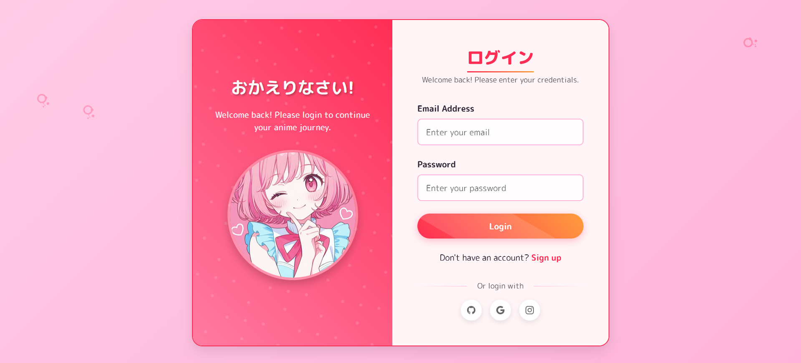
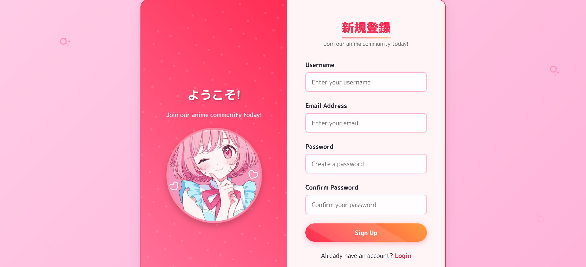

# Anime-auth-portal
# Anime Auth Portal 🎌

A beautiful anime-themed authentication portal with login and signup forms featuring sakura blossom animations and vibrant UI elements.



<!-- Add a screenshot later -->

## Features ✨
- Anime-inspired design with pink/purple color scheme
- Sakura blossom animation background
- Interactive login/signup form toggle
- Form validation with visual feedback
- Responsive design for all devices
- Social login options
- Floating anime character illustration

## Technologies Used 💻
- HTML5
- CSS3 (with animations and gradients)
- JavaScript (for form validation and interactions)
- Google Fonts (M PLUS Rounded 1c)

## Installation & Usage 🚀
1. Clone the repository:
   ```bash
   git clone https://github.com/SHARAT-S-UNNITHAN/Anime-auth-portal.git

   Open index.html in your browser

That's it! No dependencies required

Customization 🎨
Replace the anime character image by changing the URL in the HTML

Modify colors in the :root CSS variables

Adjust animation speeds in the JavaScript

License 📜
This project is licensed under the MIT License - see the LICENSE file for details.

Credits 🙏
 **Developer**: Sharat S Unnithan
 **📧 Email**: [sharatsunnithan3@gmail.com](mailto:sharatsunnithan3@gmail.com)
 **🔗 Social Media**:

  * [Instagram](https://www.instagram.com/gamer_sharat_/)
  * [LinkedIn](https://www.linkedin.com/in/sharat-s-unnithan-b363852a7)
  * [YouTube](https://www.youtube.com/@gamersharat)
  * [GitHub](https://github.com/SHARAT-S-UNNITHAN)


Inspired by anime UI designs and Japanese aesthetic

SVG icons from Bootstrap Icons

Contributing 🤝
Contributions are welcome! Please open an issue or pull request for any improvements.
**MIT License**
```text
MIT License

Copyright (c) [year] [your name]

Permission is hereby granted, free of charge, to any person obtaining a copy
of this software and associated documentation files (the "Software"), to deal
in the Software without restriction, including without limitation the rights
to use, copy, modify, merge, publish, distribute, sublicense, and/or sell
copies of the Software, and to permit persons to whom the Software is
furnished to do so, subject to the following conditions:

The above copyright notice and this permission notice shall be included in all
copies or substantial portions of the Software.

THE SOFTWARE IS PROVIDED "AS IS", WITHOUT WARRANTY OF ANY KIND, EXPRESS OR
IMPLIED, INCLUDING BUT NOT LIMITED TO THE WARRANTIES OF MERCHANTABILITY,
FITNESS FOR A PARTICULAR PURPOSE AND NONINFRINGEMENT. IN NO EVENT SHALL THE
AUTHORS OR COPYRIGHT HOLDERS BE LIABLE FOR ANY CLAIM, DAMAGES OR OTHER
LIABILITY, WHETHER IN AN ACTION OF CONTRACT, TORT OR OTHERWISE, ARISING FROM,
OUT OF OR IN CONNECTION WITH THE SOFTWARE OR THE USE OR OTHER DEALINGS IN THE
SOFTWARE.
